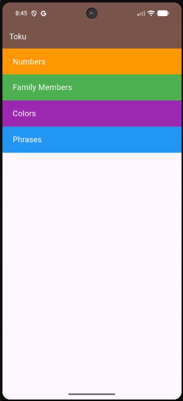
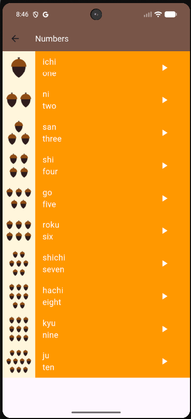
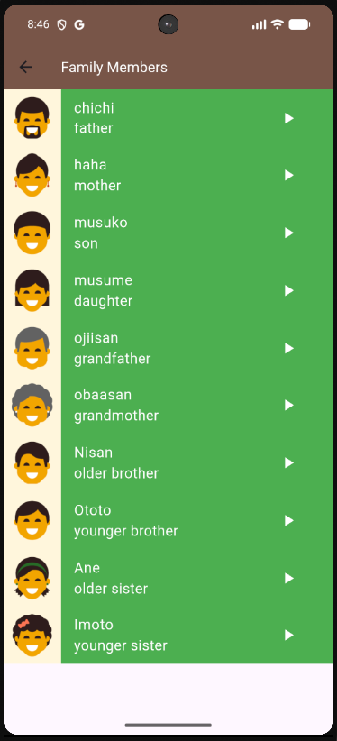
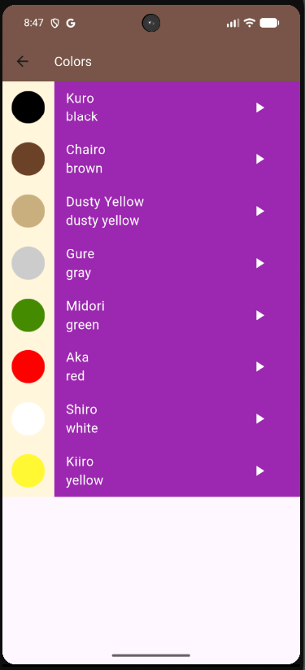
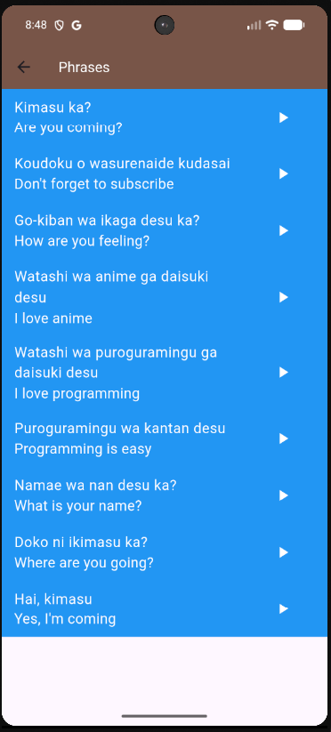

# Language Learning App (Toku)


## 📖 Project Overview
Toku is a clear, interactive vocabulary learning application designed to help users learn basic Japanese. By organizing content into intuitive categories—such as Numbers, Family Members, Colors, and Phrases—it provides users with visual aids and instant audio pronunciations to create a focused and engaging learning experience.

## ✨ Key Features
*   **Categorized Vocabulary Catalog:** Browse discrete word sets (Numbers, Family Members, Colors, Phrases) easily through the main dashboard.
*   **Interactive Audio Pronunciations:** Tap the play icon next to any vocabulary item to immediately hear its authentic Japanese pronunciation.
*   **Visual Aids Strategy:** View item-specific images designed to assist with visual memory (applied dynamically where applicable).
*   **Clean, Color-Coordinated UI:** Features distinct background colors for different categories to visually separate contexts, alongside a clean, scrolling layout.

## 🧠 Lessons Learned
*   **Component-Based Architecture:** Practiced breaking down the app logic into clearly defined layers by separating code into `models`, `views`, `widgets`, and `data` folders to improve overall scalability and organization.
*   **External Package Integration:** Learned how to seamlessly implement third-party plugins by using the `audioplayers` package to load and trigger local asset-based sound files upon user interaction.
*   **Dynamic View Generation:** Built proficiency in using `ListView.builder` to dynamically construct user interfaces based on underlying data models (e.g., `CategoryModel` and `ItemModel`), avoiding rigid, hardcoded widgets.
*   **Widget Extraction & Reusability:** Enforced the DRY (Don't Repeat Yourself) principle by actively extracting shared UI patterns into reusable, parameterized components such as `ItemWidget` and `CategoryWidget`.
*   **Centralized Constants & Styling:** Successfully moved shared text styles (`kWhite18TextStyle`) into a `constants.dart` file to maintain a unified visual system across different screens.

## 📂 Folder Structure
```text
lib/
├── constants.dart
├── data/
│   ├── category_data.dart
│   └── items_data.dart
├── main.dart
├── models/
│   ├── category_model.dart
│   └── item_model.dart
├── views/
│   ├── home_view.dart
│   └── items_view.dart
└── widgets/
    ├── category_widget.dart
    └── item_widget.dart
```

## 📸 Screenshots

<p align="center">
  
  
  
  
  
</p>
