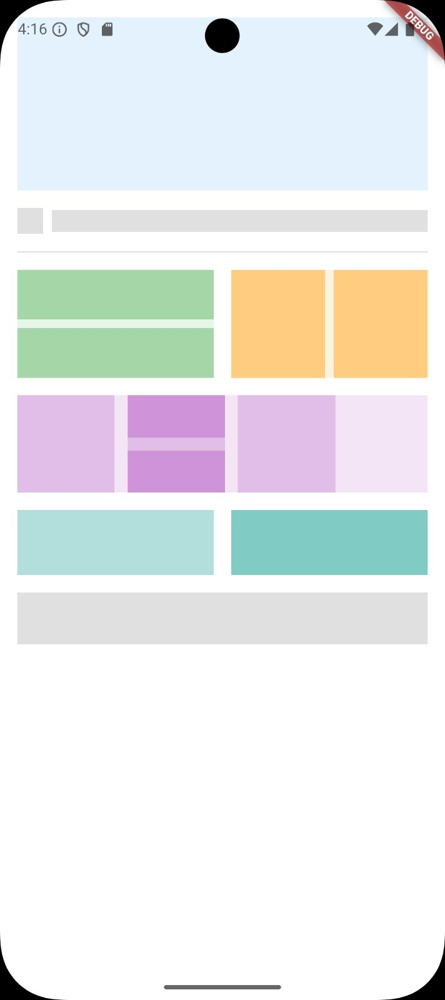

# Layout Basics


## 📖 Project Overview
Layout Basics is an experimental project strictly designed to test and exercise the limits of structural flexibility inside Flutter. It aims at replicating a complex abstract visual layout strictly through nested widgets and proportional sizing.

## ✨ Key Features
*   **Proportional Layout Grids:** Extensive geometric structures built using specifically calibrated nested widgets simulating grid layouts.
*   **Device Independence Constraint:** Adaptable sizes that react fluidly via calculated dimensions based directly on the device viewport.
*   **Intricate Row/Column Compositions:** Highly structured colored tiles explicitly designed to simulate advanced responsive UI frameworks.

## 🧠 Lessons Learned
*   **Deep Nesting Formations:** Achieved high-fidelity layout replicas by deeply and safely nesting `Row` and `Column` widgets inside one another effectively.
*   **Viewport Measurements:** Mastered the utilization of `MediaQuery.sizeOf(context)` methodologies to command absolute geometric precision adaptable to diverse screen boundaries.
*   **Box Constraints Padding:** Leveraged invisible layout manipulators like `SizedBox` effectively instead of relying solely on built-in padding parameters.

## 📂 Folder Structure
```text
lib/
├── h1.dart
└── main.dart
```

## 📸 Screenshots
<p align="center">
  
</p>
