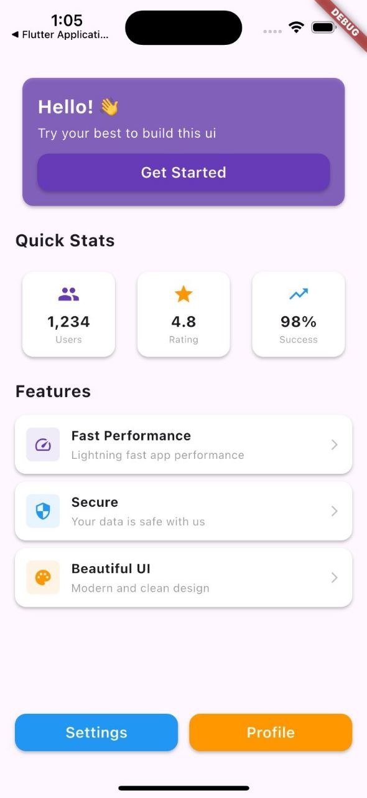

# Modern Home App


## 📖 Project Overview
The Modern Home App acts as a prototype for modern smart home management dashboards. It incorporates sleek and modern user interfaces, demonstrating how practical and aesthetic design patterns can combine to provide an exceptional user experience visually.

## ✨ Key Features
*   **Interactive Dashboard UI:** Simulated smart home controls built cohesively within an attractive modern aesthetic layout.
*   **Custom Widget Modules:** Separated, encapsulated visual components ensuring that logical interfaces remain easily readable.
*   **Clean Structural Formats:** A highly organized and visually appealing interface built directly emphasizing user-friendly aesthetics.

## 🧠 Lessons Learned
*   **Folder Separation Practices:** Transitioned heavily towards establishing isolated components by creating a dedicated `widgets/` folder specifically for reusable UI elements.
*   **Advanced UI Formatting:** Implemented modern, cutting-edge user interfaces matching detailed architectural designs logically without sacrificing execution time.
*   **File Architecture Scaling:** Learned to securely organize projects intended for broader scaling by physically moving primary screens into designated logical blocks (e.g. `home_screen.dart`).

## 📂 Folder Structure
```text
lib/
├── home_screen.dart
├── main.dart
└── widgets/
```

## 📸 Screenshots
<p align="center">
  
</p>
