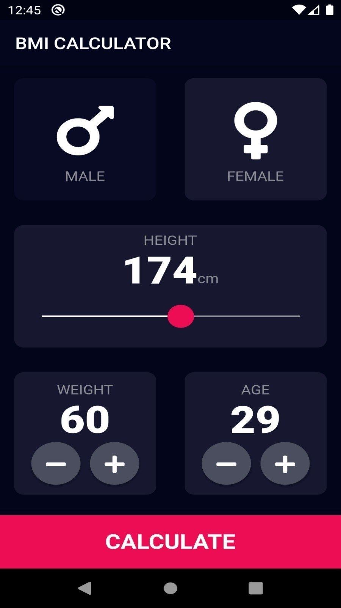

# BMI Calculator App


## 📖 Project Overview
The BMI Calculator App is a practical health utility that captures human biometrics to calculate an accurate Body Mass Index. Through interactive models, dynamic screens, and logic parsing, this app demonstrates building a functional multi-logic health application natively.

## ✨ Key Features
*   **Dynamic Biomateric Computation:** Captures variable stats (height, weight, etc.) through structured data modeling specifically adapted to process user health information appropriately.
*   **Isolated Data Screen Pipelines:** Dedicated display pipelines built solely around data input workflows separate from data calculation/presentation screens strictly.
*   **Reusable Data Components:** UI inputs formatted explicitly for user interactively without redundant codebase repeats.

## 🧠 Lessons Learned
*   **Directory Structuring Rules:** Gained immense scalability by specifically standardizing folders into `models`, `screens`, and `widgets` domains efficiently mapping MVC concepts smoothly.
*   **Data Models Setup:** Created robust `models/` components tasked strictly with housing variables effectively enabling clean business logic interactions throughout.
*   **Advanced Inter-Screen Navigation:** Practiced smoothly porting raw data objects fluidly across independent visual `screens/` without losing data scope accurately.

## 📂 Folder Structure
```text
lib/
├── main.dart
├── models/
├── screens/
└── widgets/
```

## 📸 Screenshots
<p align="center">
  
</p>
