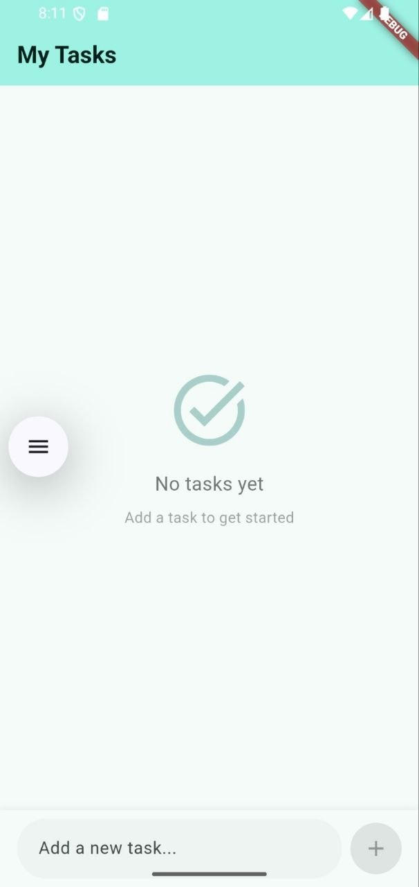
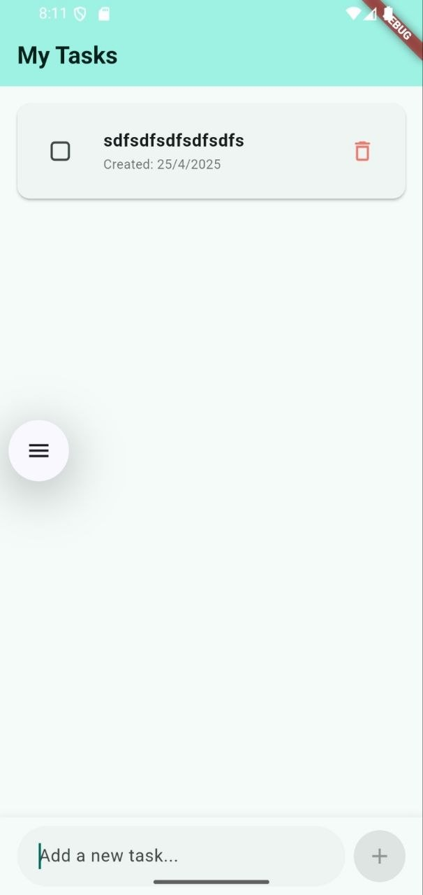
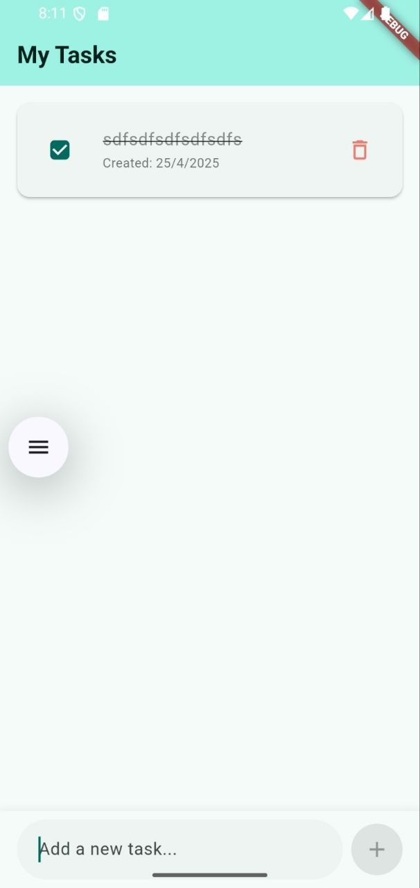

# To-Do App


## 📖 Project Overview
The To-Do App is a highly productive task management tool emphasizing persistent list tracking. The application accurately reflects real-world engineering methodologies utilized widely to systematically handle data generation natively.

## ✨ Key Features
*   **Task List Mechanics:** Integrated scrollable systems specifically established to portray user-added inputs predictably over time safely.
*   **Multi-View Portals:** Dynamic transition mechanisms routing user-driven data effortlessly across several unique, specifically modeled application views visually.
*   **Task Data Formats:** Deep logical state arrays handling tasks constructed distinctly around a `models/` centered architecture efficiently.

## 🧠 Lessons Learned
*   **Robust State Architectures:** Solidified architectural foundations mapping standard engineering structures cleanly into `models`, `views`, and `widgets` natively promoting clean architecture methodologies effectively.
*   **Persistent Interaction Loops:** Dealt interactively with multi-layer screen manipulations specifically focused exclusively on maintaining real-world CRUD-like state tracking logic explicitly.
*   **State-View Syncing Details:** Implemented tight state transitions ensuring any modification inside a `model` directly reroutes flawlessly and immediately safely reflecting across global `views/`.

## 📂 Folder Structure
```text
lib/
├── main.dart
├── models/
├── views/
└── widgets/
```

## 📸 Screenshots
<p align="center">
  
  
  
</p>
