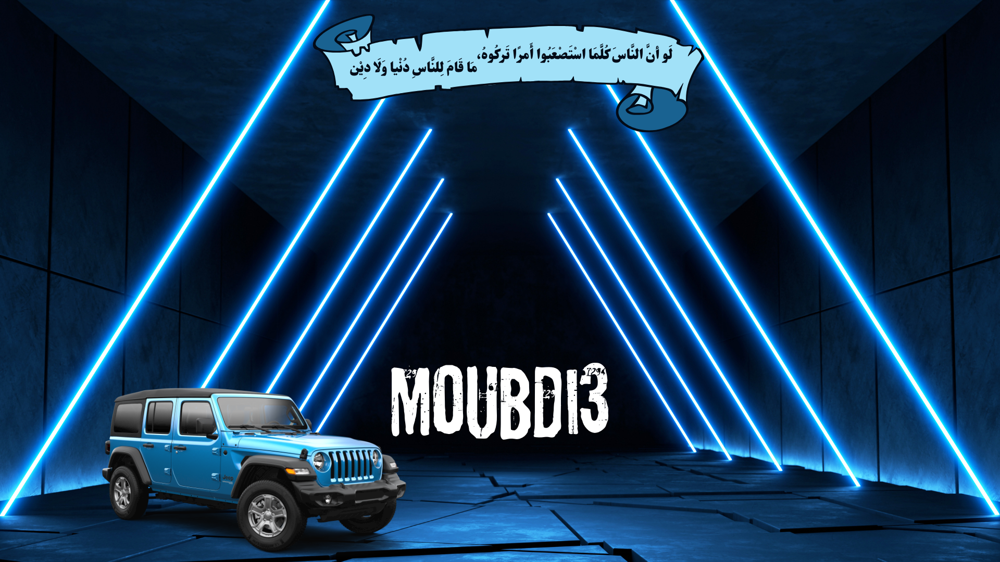

# Layout Demo App


## 📖 Project Overview
The Layout Demo App fundamentally explores complex visual stacking techniques natively within Flutter. It showcases advanced UI compositions relying upon background image layering combined directly with floating foreground elements interactively.

## ✨ Key Features
*   **Background Layering:** Employs full-screen graphic configurations visually establishing deep design tones immediately.
*   **Visual Stack Rendering:** Layered interaction points rendering effectively directly overlapping pre-configured background bounds.
*   **Container Flexibilities:** Heavy usage of `Container` decoration logic scaling appropriately alongside viewport transformations robustly.

## 🧠 Lessons Learned
*   **Image Layer Management:** Accomplished complex image alignments dynamically inserting visual assets securely across the application's root backgrounds uniformly.
*   **Stack Logic Deployments:** Gained direct working knowledge implementing complex structural overlaps using `Stack` and `Positioned` algorithms natively.
*   **Single View Consolidations:** Experimentally formulated monolithic rendering trees directly inside isolated files (`layout_demo_screen.dart`) purely for fast structural layout understanding iteratively.

## 📂 Folder Structure
```text
lib/
├── layout_demo_screen.dart
└── main.dart
```

## 📸 Screenshots
<p align="center">
  
</p>
